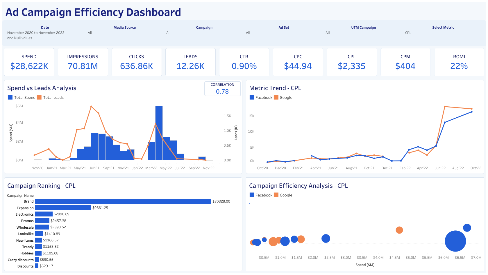

# Marketing Performance Dashboard

## Project Objective

This project presents an interactive marketing performance dashboard that consolidates Facebook Ads and Google Ads data into a single analytical view. It enables business users to monitor advertising spend, engagement, lead generation, campaign efficiency, and return on marketing investment across channels, campaigns, ad sets, and UTM campaigns.

## Data Sources

The final dataset was prepared from four PostgreSQL tables:

- `facebook_ads_basic_daily` — daily Facebook advertising performance.
- `facebook_campaign` — Facebook campaign dictionary used to retrieve campaign names.
- `facebook_adset` — Facebook ad set dictionary used to retrieve ad set names.
- `google_ads_basic_daily` — daily Google advertising performance with campaign and ad set attributes.

The repository includes the final analytical CSV export used by Tableau. The original database tables are not included.

## Data Preparation

Data preparation was completed in PostgreSQL and DBeaver:

1. Explored the structure and available fields in the source tables.
2. Joined Facebook Ads performance data with the campaign and ad set dictionaries using `LEFT JOIN` to retrieve `campaign_name` and `adset_name`.
3. Added a `media_source` field to distinguish Facebook from Google records.
4. Combined Facebook Ads and Google Ads with `UNION ALL`.
5. Extracted and URL-decoded the `utm_campaign` value from advertising URL parameters.
6. Converted empty and `nan` UTM values to `NULL`.
7. Used `COALESCE` to replace missing numeric measures with zero.
8. Aggregated spend, clicks, impressions, reach, leads, and conversion value at the daily campaign and ad set level.
9. Exported the resulting dataset to CSV for use in Tableau.

The complete preparation query is available in [`sql/marketing_data.sql`](sql/marketing_data.sql).

## Key Metrics

- **CTR (Click-Through Rate):** clicks divided by impressions.
- **CPC (Cost per Click):** spend divided by clicks.
- **CPM (Cost per Thousand Impressions):** spend divided by impressions, multiplied by 1,000.
- **CPL (Cost per Lead):** spend divided by leads.
- **ROMI (Return on Marketing Investment):** `(value - spend) / spend`.
- **Clicks to Leads Conversion:** leads divided by clicks.
- **Reach to Leads Conversion:** leads divided by reach.

## Dashboard Features

The Tableau dashboard includes:

- KPI cards for Spend, Impressions, Clicks, Leads, CTR, CPC, CPL, CPM, and ROMI.
- **Spend vs Leads Analysis:** a dual-axis monthly view of advertising spend and generated leads, with a separate correlation indicator. Monthly spend and leads are calculated with FIXED LOD expressions.
- **Metric Trend:** a time-series comparison of the selected metric for Facebook and Google.
- **Campaign Ranking:** a descending horizontal bar chart that ranks campaigns by the selected metric.
- **Campaign Efficiency Analysis:** a scatter plot using Spend on the x-axis, the selected metric on the y-axis, campaign name as detail, media source as color, and leads as bubble size.
- A **Select Metric** parameter that switches between CTR, CPC, CPL, ROMI, Clicks to Leads Conversion, and Reach to Leads Conversion. The default selection is CPL.
- Filters for Date/Month, Media Source, Campaign, Ad Set, and UTM Campaign.
- A dashboard filter action: selecting a campaign in Campaign Efficiency Analysis filters Metric Trend and Spend vs Leads Analysis through `campaign_name`.

## Dashboard Preview

[](https://public.tableau.com/app/profile/dmytro.onishchuk/viz/Onishchuk_PJ2_Tableau/AdCampaignEfficiencyDashboard)

## Tools

- PostgreSQL
- DBeaver
- SQL
- Tableau Public
- CSV
- Git and GitHub

## Repository Structure

```text
marketing-performance-dashboard/
├── README.md
├── .gitignore
├── data/
│   └── Onishchuk_Project_2.csv
├── images/
│   └── ad_campaign_efficiency_dashboard.png
├── sql/
│   └── marketing_data.sql
└── tableau/
    └── marketing_performance_dashboard.twb
```

## Key Skills Demonstrated

- SQL-based data exploration, cleaning, and transformation.
- Relational data modeling with joins and dictionary tables.
- Multi-source data integration with `UNION ALL`.
- Missing-value handling and UTM parameter decoding.
- KPI design and calculated field development in Tableau.
- FIXED LOD expressions and correlation analysis.
- Parameter-driven visualizations and interactive dashboard actions.
- Business-focused dashboard design and data storytelling.

## Tableau Public

Explore the interactive dashboard on [Tableau Public](https://public.tableau.com/app/profile/dmytro.onishchuk/viz/Onishchuk_PJ2_Tableau/AdCampaignEfficiencyDashboard).
